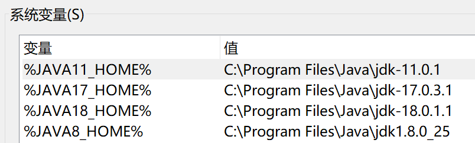

# utools-switchjava

在utools中一键切换java环境变量

初始笨拙版本，使用固定的四个版本切换，若未安装可忽略，目前会在utools程序目录下拉屎，刚接触utools的编写，不了解如何程序私有目录的获取等。

# 注意！
！！！！**请执行以下步骤后再使用本程序**！！！！

1.在系统环境变量path中加入  %JAVA_HOME%/bin

2.按照以下图示添加系统环境变量四个(变量名需和图中相同),若未安装对应java版本可忽略对应变量,对应版本的值请填写自己电脑中对应版本的路径，无需加/bin。

3.使用本程序
